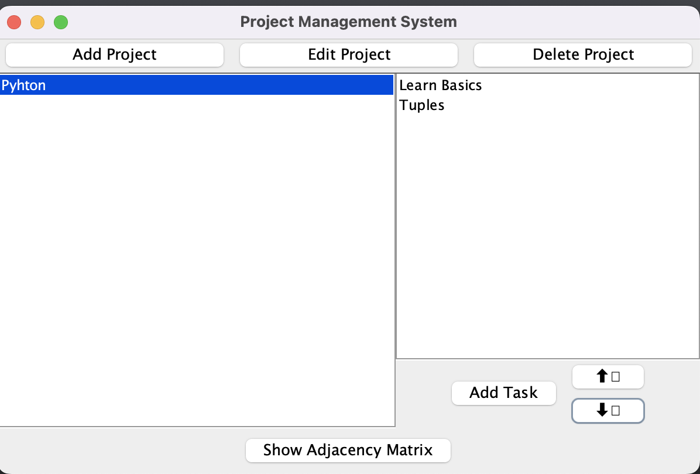

# Project Manager App 🚀

A streamlined task and project management app built with Java and Kotlin, enabling efficient organization, real-time collaboration, and task tracking for software development teams.

## 🖼️ Preview

**Tech Stack:**  
- **Languages:** Java, Kotlin  
- **Features:** Task management, real-time updates, intuitive UI, progress tracking.
